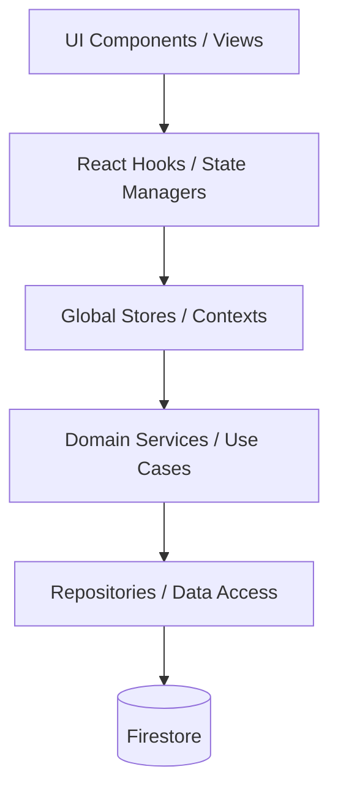

# Dependency Graph

This document illustrates the internal dependency flow from the UI layer down to the persistence layer.

## Constraints
- **Strict Layering**: A layer can only depend on layers directly below it or adjacent utility layers.
- **UI Independence**: UI and Hooks must not contain direct database queries or raw `firebase` SDK calls.
- **Repository Isolation**: Only Repositories should execute Firestore SDK commands.
- **State Integrity**: Stores manage client state and cache, they must sync via Services/API, not directly touching Repositories.
