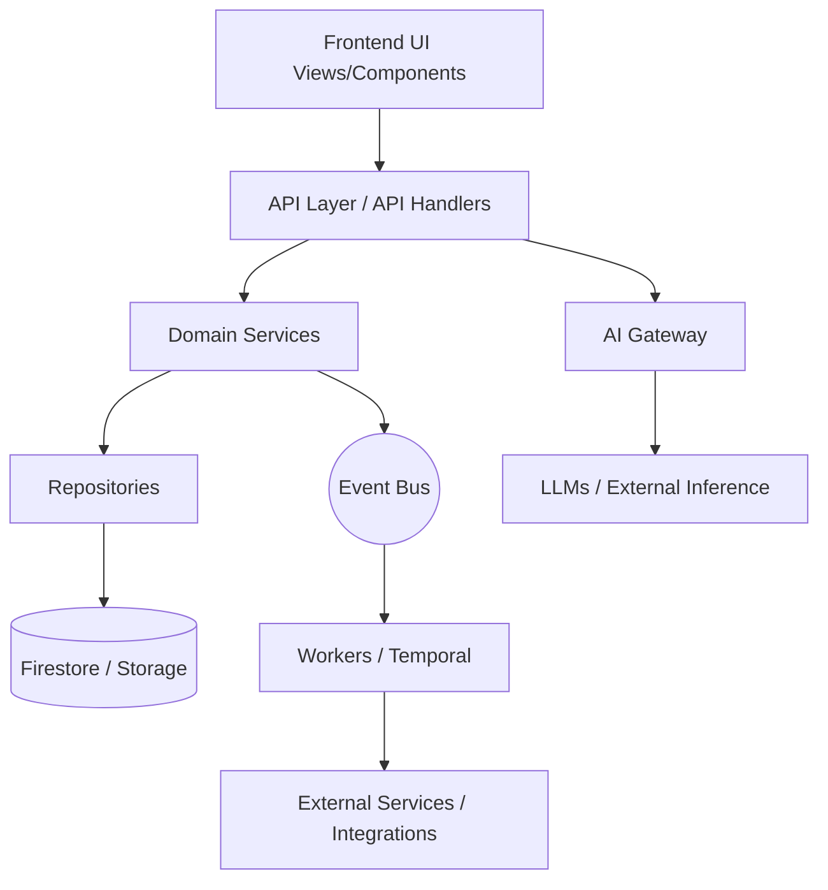

# System Architecture

This document describes the high-level architecture flow of the HireNest OS from the client tier down to external infrastructure.

## Layers
1. **Frontend**: React-based UI, components, and views (`src/views`, `src/components`).
2. **API**: Routing, request validation, rate limiting, economic isolation (`src/api-lib`, `api/`).
3. **Services**: Core domain logic, matching engine, intelligence (`src/services`).
4. **Repositories**: Data access abstraction pattern.
5. **Firestore**: The primary single source of truth database.
6. **Event Bus**: Local and distributed publish/subscribe message broker (`src/events`).
7. **AI Gateway**: Centralized LLM capability router (`src/ai`).
8. **Workers**: Durable asynchronous workflows (Temporal, background syncs) (`src/workflows`).
9. **External Services**: CRM integrations, vendor APIs, email providers, external AI models.
